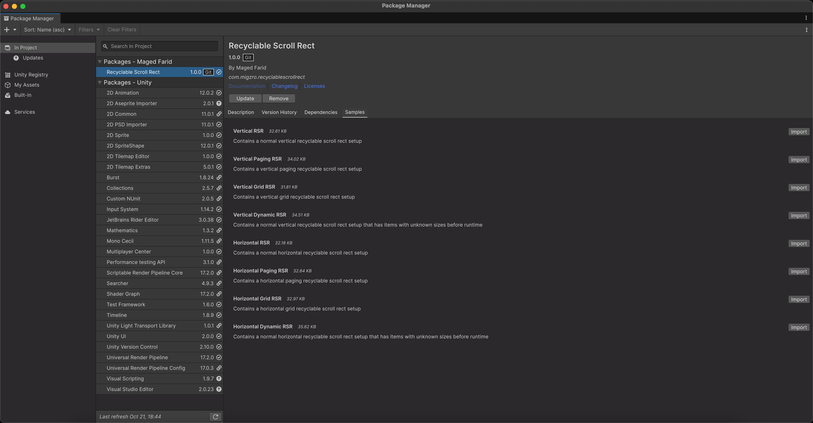

# Recyclable Scroll Rect for Unity UI
An ListView implementation for Unity’s UI that recycles item views, designed to handle large data sets efficiently.

## 📘 Features
- Seamless infinite (or large-scale) scrolling of UI lists.
- Supports vertical, horizontal layouts with reverse arrangments.
- Supports grid layouts with start axes and corners.
- Supports pages layouts (like TikTok).
- Reuses (recycles) item views instead of creating/destroying repeatedly.
- Supports multiple gameObject prototypes.
- Supports unknown item sizes with dynamic layout recalculation.
- Supports extra visible items for smoother scrolling.
- Supports reloading of data source.

## 🎬 Demo
### Vertical RSR


### Horizontal RSR


### Grid RSR


### Paged RSR


### Vertical Dynamic RSR with Data Source Reloading


## 🚀 Installation
### Method 1
Import from git url in Unity Package Manager using this link:
   ```bash
   https://github.com/Migzro/Recyclable-Scroll-Rect.git
   ```
### Method 2
Download the latest Unity package from the [Releases](v1.0.1)
[Link text](https://github.com/Migzro/Recyclable-Scroll-Rect/releases)

## 🧩 Samples
### Importing from Unity Package Manager
After installing via Package Manager, go to `Window > Package Manager`, select `Recyclable Scroll Rect`, and click `Samples` tab to import any demo.



### Importing from Unity Package
Open the sample scenes located in `Assets/Recyclable Scroll Rect/Samples` to see examples of vertical, horizontal, grid, and paged layouts.

## ⚙️ Usage
1. Add the required `RSR` component to a `ScrollRect` GameObject.
2. Implement the `IDataSource` interface in a MonoBehaviour script to provide data and item views.
```csharp
public class VerticalRSRDemo : MonoBehaviour, IDataSource
{
    [SerializeField] private int _itemsCount;
    [SerializeField] private RSR _scrollRect;
    [SerializeField] private GameObject[] _prototypeItems;

    private List<string> _dataSource;
    private int _itemCount;

    public int ItemsCount => _itemsCount;
    public bool IsItemSizeKnown => true;
    public GameObject[] PrototypeItems => _prototypeItems;

    private void Start()
    {
        _dataSource = new List<string>();
        for (var i = 0; i < _itemsCount; i++)
            _dataSource.Add(i.ToString());
        _scrollRect.Initialize(this);
    }

    public float GetItemSize(int itemIndex)
    {
        return 40.22f;
    }

    public void SetItemData(IItem item, int itemIndex)
    {
        (item as DemoItemPrototype)?.Initialize(_dataSource[itemIndex]);
    }

    public GameObject GetItemPrototype(int itemIndex)
    {
        if (itemIndex % 2 == 0)
            return _prototypeItems[0];
        return _prototypeItems[1];
    }

    public bool IsItemStatic(int itemIndex)
    {
        return false;
    }
}
```

## 🔮 Coming Soon
Here’s what’s planned for upcoming releases of **Recyclable Scroll Rect**:
- 🧩 Sections with headers and footers
- ⚙️ Support for carousel mode
- 📐 Smoother scrolling with Dotween integration

## 🧪 Why Use This?
For large lists or grids (hundreds/thousands of items), regular UI instantiation is heavy.  
This component **reuses** item views to keep performance smooth and memory low.

## 🧩 Example Use Cases
- Chat message lists
- Inventories
- Infinite scrolling feeds
- Thumbnail grids

## 📝 Release Notes
See `CHANGELOG.md` for details.

## 📄 License
MIT License — see `LICENSE.md`.

## 🙋 Support
Open an issue on GitHub for help or feature requests.

---

Thanks for using **Recyclable Scroll Rect** — happy scrolling! 🎉